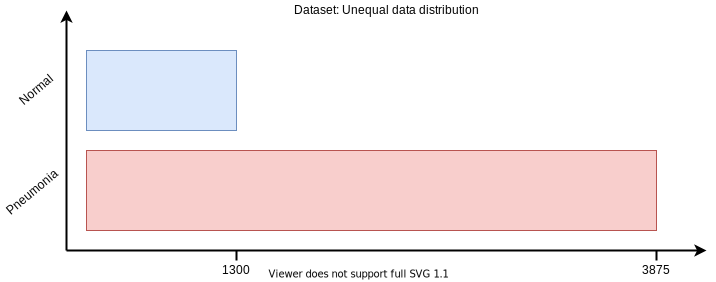

# Challenge: Pneumonia detector

Given a lungs x-ray dataset, we created a model that can classify the lung as "Normal" or "Pneumonia", avec un score de 90%+. Moreover, we tried to make the lightest possible model: 2500 parameters, without any convolution.

### 1. Data analysis

We started from the [chest x-ray image](https://www.kaggle.com/paultimothymooney/chest-xray-pneumonia/) from kaggle.

#### Problem: Unequal data distribution

  

The dataset is rather badly balanced: 1300 images of "Normal" lungs and 3875 of "Pneumonia" lungs. We decided, during the data transformation, to reduce the size our dataset in order to have a more balanced distribution of the data.

#### Problem: Multiple sizes images

  

The radiographs in this dataset are all different sizes. During our analysis, we determined that the 75%-percentile size of the images was **1000x1300**. We resized all the images to this size.

### 2. Data transformation

Here is the transformation process applied to all the images in our dataset. Its goal is to allow the model to focus on the essential (the lungs) while keeping a maximum of information to improve the prediction.

  

#### Step1: Resize and crop
The images are first resized to 1000x1300. Then we cut out an edge that is approximately 10% of the image as top, bottom, left and right padding. This is to remove unnecessary areas such as the black background, arms, and letters/notes usually positioned at the top left of the image.

#### Step2: Normalize and resize again
The RGB layers are merged and normalized into a single layer. This is what gives this green color to the graph. Then the image is resized by MaxPooling to 10x14.

### Step3: Vectorization and exportation
There is no convolution in our model, so there is no reason to keep a multi-dimensional image. It is therefore transformed into a vector of (140,). Finally, the images are saved via h5py.

The different datasets we have generated [are available here](./datasets/).

### 3. Model evaluation